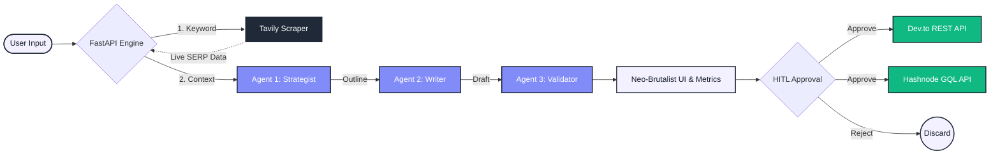

# Artifauctor - Autonomous Content Pipeline

An enterprise-grade, multi-agent AI SEO engine that researches, drafts, validates, and autonomously deploys high-ranking content using a Human-in-the-Loop (HITL) architecture.

## System Architecture

## Core Features

### Multi-Agent AI Pipeline
- **Strategist Agent:** Analyzes live SERP gaps to create hyper-targeted, domain-specific outlines.
- **Master Writer Agent:** Drafts 1,000+ word deep-dives using the PAS framework (Problem-Agitate-Solution) with code snippets and Markdown tables.
- **Validator Agent:** Runs local heuristic scoring for SEO performance, naturalness, keyword density, and snippet readiness.

### Real-Time Intelligence & Reliability
- **Zero-Hallucination Grounding:** Uses Tavily to inject live Google Search data directly into the LLM context window.
- **Enterprise Retry Logic:** Built-in exponential backoff to seamlessly handle API rate limits (HTTP 429) without crashing.

### Human-in-the-Loop (HITL) Deployment
- **Staging Dashboard:** Holds generated content in a pending state for editorial review.
- **One-Click Publishing:** Transforms approved drafts into live articles on Dev.to and Hashnode instantly.
- **BYOK Architecture:** Designed to support "Bring Your Own Key" for stateless, zero-liability public hosting.

### Neo-Brutalist UX
- **Custom CSS Engine:** Pastel Space Grotesk aesthetics with sharp borders, heavy shadows, and interactive input pills.
- **Agent Visualizer:** Custom CSS keyframe animations representing the 3 backend agents working in tandem.

## Technology Stack

**Backend**
- Python 3.9+ / FastAPI
- Uvicorn (ASGI Server)

**AI & External APIs**
- Google Gemini API (gemini-2.5-flash-lite)
- Tavily Search API
- Hashnode GraphQL 2.0 API
- Dev.to REST API

**Frontend**
- HTML5 / Vanilla JavaScript (ES6)
- Tailwind CSS (Utility styling)
- Marked.js (Markdown to HTML parsing)

## API Overview

### AI Generation (/api/v1)
| Endpoint | Method | Description |
|----------|--------|-------------|
| `/generate` | POST | Triggers SERP scraper and full multi-agent generation pipeline. Returns content & SEO metrics. |

### HITL Deployment (/api/v1/publish)
| Endpoint | Method | Description |
|----------|--------|-------------|
| `/publish/devto` | POST | Pushes approved Markdown payload to Dev.to via REST API. Returns live URL. |
| `/publish/hashnode` | POST | Pushes approved Markdown payload to Hashnode via GraphQL. Returns live URL. |

## License

