# Artifauctor - Autonomous Content Pipeline v2.0

An enterprise-grade, multi-agent AI SEO engine that researches, drafts, validates, and autonomously deploys high-ranking content. **Version 2.0** introduces Hybrid ML Semantic Validation, Asynchronous Auto-Deployment, and a multi-tenant User Vault.

## System Architecture (v2.0)

```mermaid
flowchart LR
    %% Styling
    classDef input fill:#f3f0ff,stroke:#1f2937,stroke-width:2px,color:#111827
    classDef agent fill:#818cf8,stroke:#1f2937,stroke-width:2px,color:#fff
    classDef external fill:#1f2937,stroke:#fff,stroke-width:2px,color:#fff
    classDef deploy fill:#10b981,stroke:#1f2937,stroke-width:2px,color:#fff
    classDef db fill:#f59e0b,stroke:#1f2937,stroke-width:2px,color:#fff

    %% Flow
    User([User Input / Auth]) --> API{FastAPI Engine}
    
    %% DB & Research Phase
    API <-->|RAG-Lite Links| Vault[(SQLite DB)]
    API -->|1. Keyword| Scraper[Tavily Scraper]
    Scraper -.->|Live SERP Data| API
    
    %% Multi-Agent Pipeline
    API -->|2. Context| Strat[Agent 1: Strategist]
    Strat -->|Outline| Writer[Agent 2: Writer]
    Writer -->|Draft| Social[Agent 3: Social Architect]
    Social -->|Post & Thread| Val[Agent 4: ML Validator]
    
    %% HITL & Background Tasks
    Val -->|Draft Saved| UI[Neo-Brutalist UI]
    UI --> App{Action}
    App -->|Approve Now| Publish
    App -->|Schedule| Worker((APScheduler))
    Worker -.->|CRON Trigger| Publish
    
    %% Publishing
    Publish --> DevTo[Dev.to API]
    Publish --> Hash[Hashnode API]

    %% Apply Classes
    class User,UI input;
    class Strat,Writer,Social,Val agent;
    class Scraper external;
    class DevTo,Hash deploy;
    class Vault,Worker db;
```

## Core Features

### Multi-Agent AI Pipeline
- **Strategist Agent:** Analyzes live SERP gaps to create hyper-targeted, domain-specific outlines.
- **Master Writer Agent:** Drafts 1,000+ word deep-dives using the PAS framework (Problem-Agitate-Solution) with code snippets and Markdown tables.
- **Validator Agent:** Runs local heuristic scoring for SEO performance, naturalness, keyword density, and snippet readiness.

### Asynchronous Publishing Engine
- **Auto-Deploy Scheduler:** Built with apscheduler. Users can draft content and set future deployment timestamps. A background worker silently monitors the queue and auto-publishes to external platforms exactly on time.
- **RAG-Lite Internal Linking:** The engine autonomously pulls a user's previously published URLs from the database and injects them into the Writer Agent's context window for dynamic SEO backlinking.

### The Vault (Multi-Tenant Auth)
- **Stateless JWT Security:** Full user authentication allowing multiple users to operate their own pipelines.
- **Bring Your Own Key (BYOK):** Users store their own Gemini API keys securely in the DB, ensuring zero liability for public hosting.

### Social Architect (Agent 3)
- **Content Syndication:** Automatically spins off the 1,000+ word blog draft into a highly-engaging LinkedIn post and a viral Twitter/X Thread, ready for 1-click clipboard copying.

### Hybrid ML Validator (Agent 4)
- **Upgraded Heuristics:** Transitions from basic heuristics to a local Machine Learning pipeline.
- **Semantic Cosine Similarity:** Uses Hugging Face's all-MiniLM-L6-v2 via sentence-transformers to guarantee the generated content semantically matches the target keyword.
- **Human-Proxy Scoring:** Calculates Flesch Reading Ease and sentence-length variance (burstiness) to ensure high "Naturalness" and avoid AI-content detectors.

### Human-in-the-Loop (HITL) Deployment
- **Staging Dashboard:** Holds generated content in a pending state for editorial review.
- **One-Click Publishing:** Transforms approved drafts into live articles on Dev.to and Hashnode instantly.
- **BYOK Architecture:** Designed to support "Bring Your Own Key" for stateless, zero-liability public hosting.

## Technology Stack

**Backend**
- Python 3.9+ / FastAPI
- Uvicorn (ASGI Server)

**AI & External APIs**
- Google Gemini API (gemini-2.5-flash/flash-lite)
- Tavily Search API
- Hashnode GraphQL 2.0 API
- Dev.to REST API

**Frontend**
- HTML5 / Vanilla JavaScript (ES6)
- Tailwind CSS (Utility styling)
- Marked.js (Markdown to HTML parsing)

## Major API Overview

### AI Generation (/api/v1)
| Endpoint | Method | Description |
|----------|--------|-------------|
| `/generate` | POST | Triggers SERP scraper and full multi-agent generation pipeline. Returns content & SEO metrics. |

### HITL Deployment (/api/v1/publish)
| Endpoint | Method | Description |
|----------|--------|-------------|
| `/publish/devto` | POST | Pushes approved Markdown payload to Dev.to via REST API. Returns live URL. |
| `/publish/hashnode` | POST | Pushes approved Markdown payload to Hashnode via GraphQL. Returns live URL. |

## License

