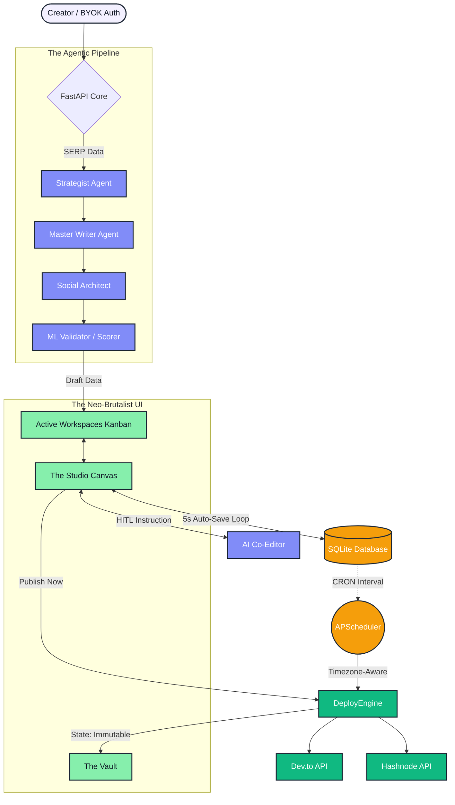

# Artifauctor - Autonomous Content Studio v3.0
 ## Development Currently Paused

A multi-tenant AI Content Management System (CMS) that researches, drafts, validates, and autonomously deploys high-ranking SEO content. **Version 3.0** transitions the engine into a full-scale SaaS platform, featuring a Neo-Brutalist collaborative Studio, a real-time AI Co-Editor, Asynchronous Auto-Save, and an Immutable Artifact Vault.

## System Architecture (v3.0)

## Core Features (v3.0 Upgrades)

### The Studio & Active Board
- **Author Note Taking:** Integrated note taking feature for authors.
- **The Editor Canvas:** A distraction-free workspace featuring a live Markdown-to-HTML rendering toggle.
- **Asynchronous Auto-Save:** A silent background thread syncs canvas keystrokes to the database every 5 seconds, ensuring zero data loss.
- **The Kill Switch:** A secure, permanent workspace purge protocol.

### AI Co-Editor (Human-In-The-Loop)
- **Interactive Editing:** Users are no longer restricted to the initial AI generation. The Studio features an integrated AI Co-Editor that accepts natural language instructions (e.g., "Make the intro punchier and add a section about Docker") to rewrite specific canvas elements on the fly.
- **The Muse:** A globally accessible, chat-based brainstorming agent built directly into the UI to help creators ideate before launching a pipeline.

### The Vault (Immutable CMS)
- **Immutable Artifacts:** Once an article is deployed (manually or via the scheduler), it is locked into "The Vault" as an Immutable Artifact.
- **Cross-Platform Syndication:** Deploy a published Hashnode article directly to Dev.to with one click without leaving the Vault.
- **Project Cloning:** Instantly duplicate a successful historical artifact back into the Active Board for a Version 2 rewrite.

### Multi-Agent AI Generation
- **Strategist Agent:** Analyzes live SERP gaps via Tavily to create hyper-targeted outlines.
- **Master Writer Agent:** Drafts 1,000+ word deep-dives with Markdown tables and code snippets.
- **Social Architect:** Spins the final draft into high-converting LinkedIn posts and X/Twitter threads.
- **Hybrid ML Validator:** Runs semantic cosine similarity (HuggingFace) and readability heuristics to generate SEO and "Humanness" scores, which are now permanently stored in the database.

### Timezone-Aware Auto-Deployment
- **Smart Scheduling:** Set local browser deployment times; the engine autonomously normalizes to UTC and publishes to external platforms while the user is offline via apscheduler.

## Technology Stack

**Backend**
- Python 3.9+ / FastAPI
- Uvicorn (ASGI Server)

**AI & External APIs**
- Google Gemini API (gemini-2.5-flash/flash-lite)
- Tavily Search API
- Hashnode GraphQL 2.0 API
- Dev.to REST API

**Frontend**
- HTML5 / Vanilla JavaScript (ES6)
- Tailwind CSS (Utility styling)
- Marked.js (Markdown to HTML parsing)

## Major API Overview

### Generation & Editing (/api/v1)
| Endpoint | Method | Description |
|----------|--------|-------------|
| `/generate` | POST | Triggers SERP scraper and full multi-agent pipeline. Initializes a new Workspace. |
| `/workspaces/active` | GET | Fetches all mutable drafts and scheduled workspaces for the Kanban board. |
| `/workspaces/{id}/save` | PUT | The 5-second auto-save bridge for the canvas text. |
| `/workspaces/{id}/correct` | POST | Triggers the AI Co-Editor to rewrite canvas content based on user instructions. |
| `/muse` | POST | Communicates with the global brainstorming AI assistant. |
| `/workspaces/{id}` | DELETE | The Kill Switch. Permanently purges a draft from the database. |

### The Vault & Publishing (/api/v1)
| Endpoint | Method | Description |
|----------|--------|-------------|
| `/workspaces/vault` | GET | Fetches all immutable, published artifacts. |
| `/workspaces/{id}/clone` | POST | Duplicates a Vault artifact into a fresh Active Workspace. |
| `/publish/{platform}/{id}` | POST | Deploys an Active draft to Dev.to or Hashnode and moves it to the Vault. |
| `/publish/vault/{id}/{platform}` | POST | Cross-publishes an already immutable artifact to a secondary platform. |

## License

